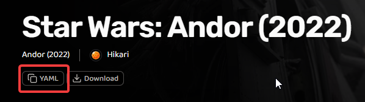
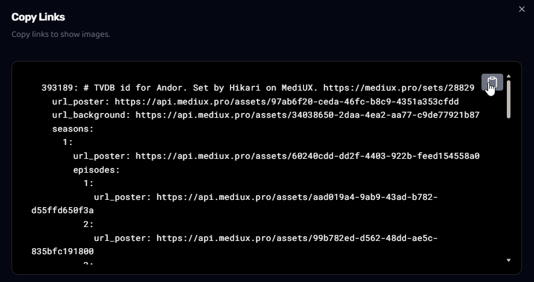
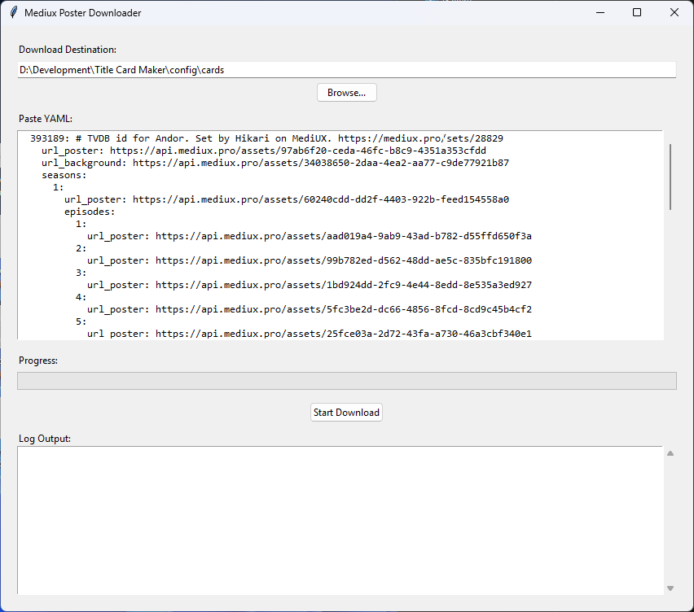
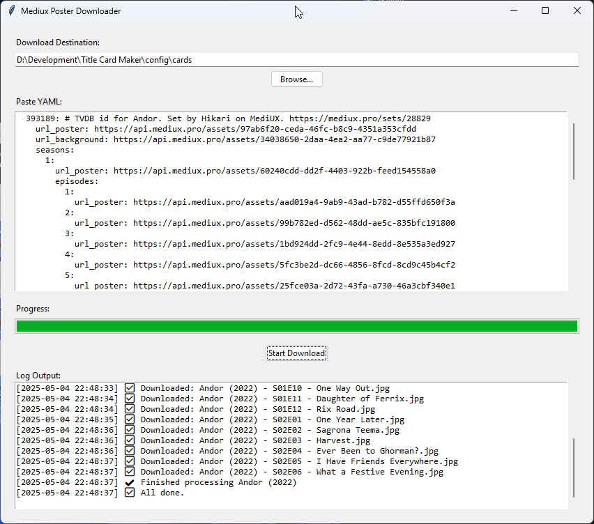

# 🎞️ Mediux YAML Downloader

A desktop GUI tool (tested on Windows) to download episode title cards, show posters, season posters, and backgrounds based on Mediux YAML configuration files and The Movie Database (TMDb) metadata.

---

## 📦 Features

- Paste YAML from [Mediux](https://mediux.pro) directly.
- Automatically fetch show titles and episode names from TMDb.
- Downloads:
  - 🖼️ Missing **episode title cards**
  - 🎭 **Show posters** as `poster.jpg`
  - 🌌 **Backgrounds** as `background.jpg`
  - 📦 **Season posters** as `seasonXX.jpg`, or `specials.jpg` for Season 0
- Folder `Season 0` is renamed to `Specials`
- Skips already downloaded images automatically
- Persistent settings:
  - Remembers your TMDb API key
  - Remembers your last used destination folder
- Built-in progress bar and real-time logging
- GUI for folder browsing and API key management
- Easy to convert into a standalone `.exe`

---

## ✅ Requirements

- Python 3.8 or higher
- Required Python packages:

```bash
pip install requests pyyaml
```

---

## 🛠️ How to Use

### 1. Clone this repository or [download `mediux_titlecards_gui.py`](./mediux_titlecards_gui.py)

---

### 2. Run the script

```bash
python mediux_titlecards_gui.py
```

---

### 3. First-time setup: API Key and Folder

- On first launch, you'll be prompted to enter your TMDb API key (one-time).
- Choose or confirm a download destination folder.
- These preferences are saved in `userconfig.json`.

---

### 4. Copy YAML from Mediux

Click the `YAML` button on a Mediux set page to copy the configuration.



Then copy the generated YAML block:



Paste your copied YAML into the app and click "Start Download":



You'll see download progress and logs:



---

## 📂 Folder Structure

Downloaded images are saved to:

```
<Destination Folder>/
  └── Show Title (Year)/
      ├── poster.jpg
      ├── background.jpg
      ├── Specials/                  # if season 0 exists
      │   ├── specials.jpg
      │   └── Episode cards...
      └── Season 01/
          ├── season01.jpg
          └── Episode cards...
```

Example:

```
D:/Title Cards/Andor (2022)/Season 1/Andor (2022) - S01E01 - Kassa.jpg
```

---

## 💾 Convert to EXE (Optional)

To turn the script into a standalone executable:

### 1. Install `pyinstaller`:

```bash
pip install pyinstaller
```

### 2. Run the following in the script directory:

```bash
python -m pyinstaller --noconsole --onefile --icon=mediuxdownload.ico mediux_titlecards_gui.py
```

> Ensure `mediuxdownload.ico` is in the same folder.

The `.exe` will be available in the `dist/` folder.

---
